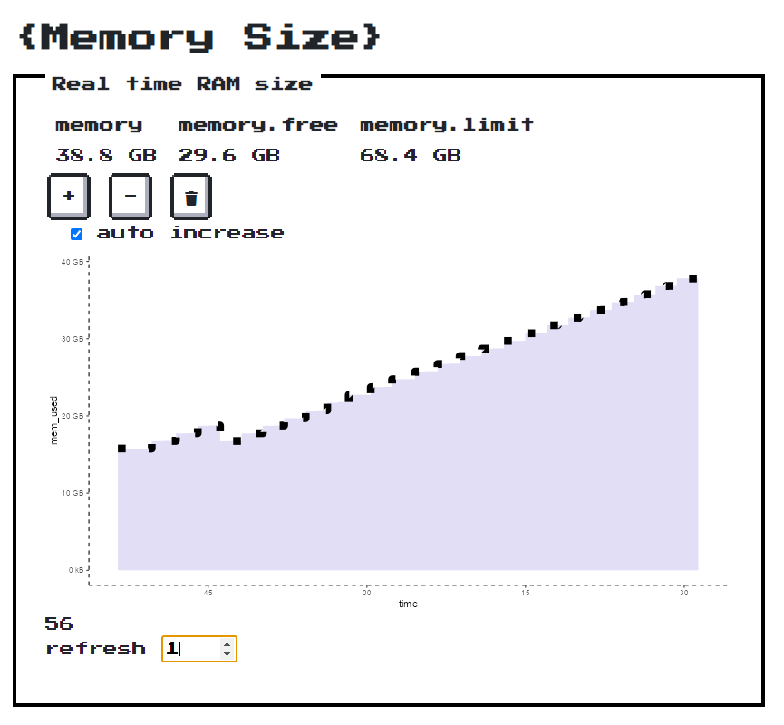

<!-- README.md is generated from README.Rmd. Please edit that file -->

```{r setup, include = FALSE}
knitr::opts_chunk$set(
  collapse = TRUE,
  comment = "#>",
  fig.path = "man/figures/README-",
  out.width = "100%"
)
```
# memory

The goal of memory is to provide a simple (useless) shiny app to _crash_ test memroy usage in production (shinyproxy, kubernetes,...)

## Installation


``` r
#install.packages("remotes")
remotes::install_github("vincentguyader/memory")
```

## Example


```{r example,eval=FALSE}
memory::run_app()
```



