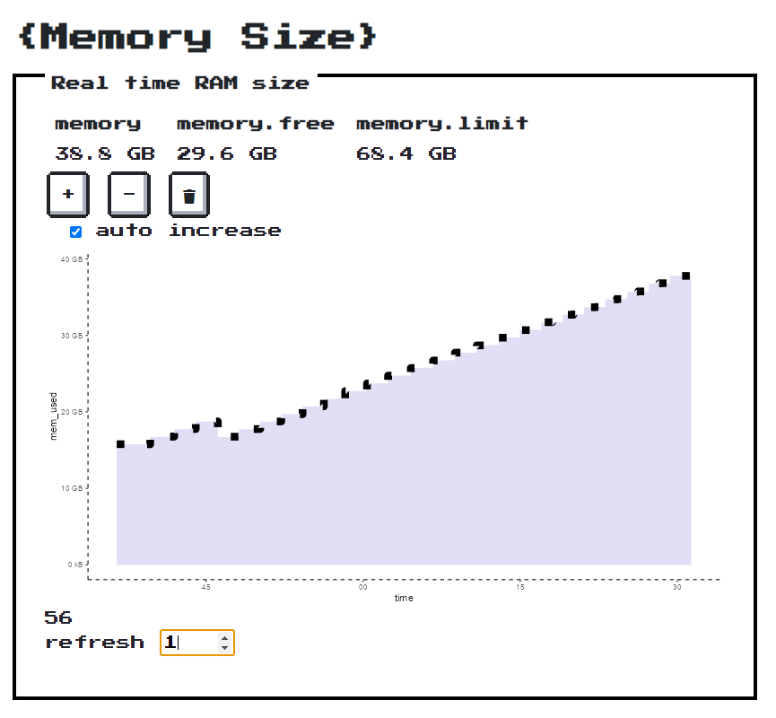

<!-- README.md is generated from README.Rmd. Please edit that file -->

# memory

The goal of memory is to provide a simple (useless) shiny app to *crash*
test memroy usage in production (shinyproxy, kubernetes,…)

## Installation

``` r
#install.packages("remotes")
remotes::install_github("vincentguyader/memory")
```

## Example

``` r
memory::run_app()
```



## usage from docker

- from docker hub

``` bash
docker run -p 80:3838 thinkr/memory
```

- (re)build localy

``` r
golem::add_dockerfile_with_renv_shinyproxy(source_folder = "deploy")
```

``` bash
cd deploy
docker build -f Dockerfile_base --progress=plain -t memory_base .
docker build -f Dockerfile --progress=plain -t memory:latest .
docker run -p 3838:3838 memory:latest
# then go to 127.0.0.1:3838
```

## deploy to posit Connect

``` r
rsconnect::deployApp()
```
